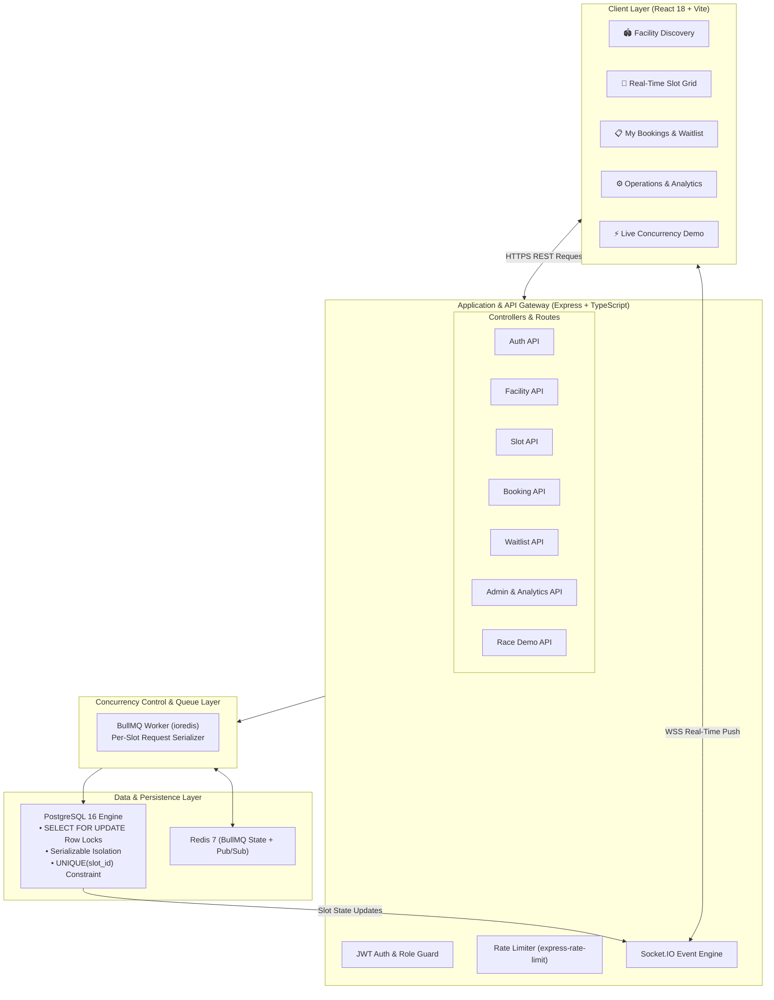
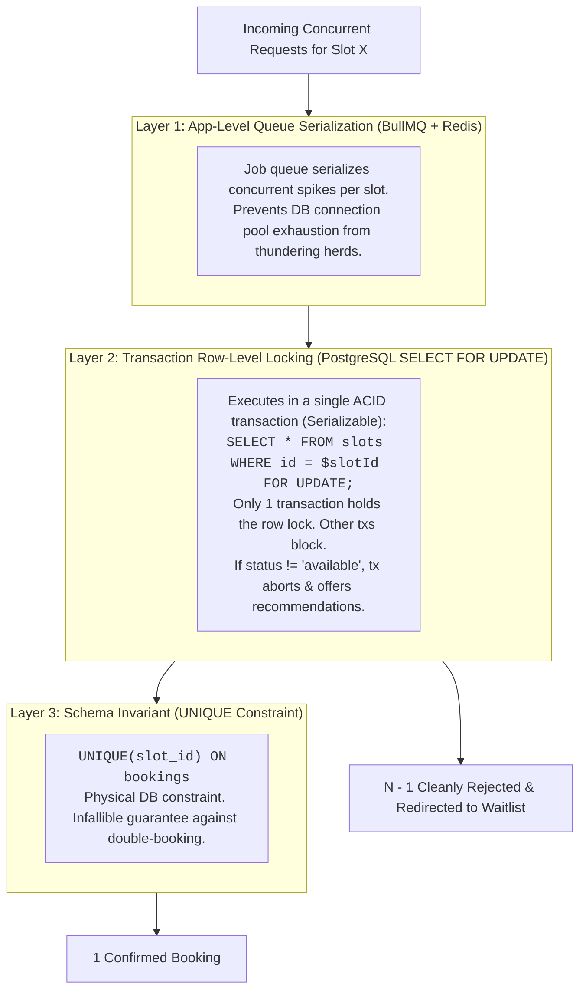
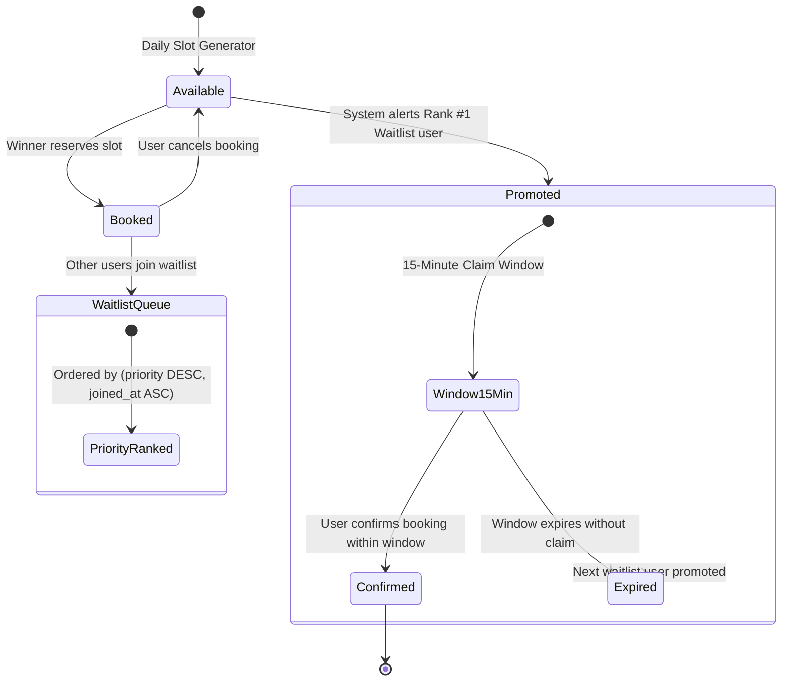
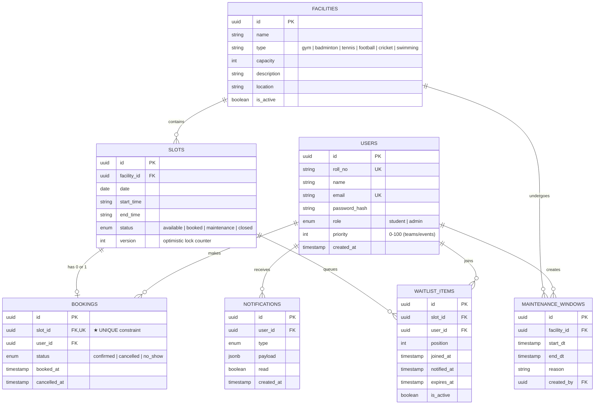

# 🏆 IIT Guwahati — Sports Facility Booking System
> **Make every game count. A concurrency-safe, real-time digital layer for sports at IIT Guwahati.**

---

## 📑 Table of Contents
- [1. Executive Summary](#1-executive-summary)
- [2. System Architecture](#2-system-architecture)
- [3. Concurrency Control (The Core Innovation)](#3-concurrency-control-the-core-innovation)
  - [The 6:00 PM Contention Scenario](#the-600-pm-contention-scenario)
  - [3-Layer Defense Mechanism](#3-layer-defense-mechanism)
  - [Sequence Diagram: Concurrent Slot Race](#sequence-diagram-concurrent-slot-race)
- [4. Real-Time Availability & Push Pipeline](#4-real-time-availability--push-pipeline)
- [5. Intelligent Waitlist & Smart Allocation](#5-intelligent-waitlist--smart-allocation)
- [6. Data Model & Entity Relations](#6-data-model--entity-relations)
- [7. Tech Stack](#7-tech-stack)
- [8. API Reference](#8-api-reference)
- [9. Getting Started](#9-getting-started)
  - [Prerequisites](#prerequisites)
  - [Local Setup & Seeding](#local-setup--seeding)
  - [Default Demo Credentials](#default-demo-credentials)
- [10. Testing & Concurrency Verification](#10-testing--concurrency-verification)
  - [Interactive Web Race Demo](#interactive-web-race-demo)
  - [Automated CLI Stress Test](#automated-cli-stress-test)
- [11. Operations & Analytics Features](#11-operations--analytics-features)

---

## 1. Executive Summary

IIT Guwahati has a vibrant sports culture across its Student Activity Center (SAC), Indoor Sports Complex, and outdoor grounds. However, high-demand slots (e.g., Badminton courts and Gymnasium between 6:00 PM – 9:00 PM) frequently experience concurrent booking stampedes, leading to double bookings, clashes, and manual coordination overhead.

This platform provides a **zero-clash, ACID-guaranteed, real-time booking engine** that:
1. **Guarantees atomicity and single-winner resolution** during millisecond-level concurrent requests.
2. **Propagates availability instantly** via WebSockets without manual page refresh.
3. **Automates fair allocation** through priority-aware waitlists and alternative slot recommendations.
4. **Empowers facility managers** with maintenance scheduling, slot overrides, and utilization analytics.

---

## 2. System Architecture



---

## 3. Concurrency Control (The Core Innovation)

### The 6:00 PM Contention Scenario
At peak hours, $N$ students submit requests for the same court and time slot at the exact same millisecond. 

A correct booking flow must strictly satisfy four invariants:
- **Atomicity**: A booking is either fully confirmed or rejected cleanly; no partial states.
- **Uniqueness**: A facility time slot can have at most **one** valid booking.
- **Consistency**: Availability states and booking records can never contradict each other.
- **Reliability**: No race condition survives under arbitrary concurrency.

### 3-Layer Defense Mechanism



### Sequence Diagram: Concurrent Slot Race

```mermaid
sequenceDiagram
    autonumber
    actor Alice as 👤 Student A
    actor Bob as 👤 Student B
    participant API as Express API
    participant Queue as BullMQ Queue
    participant DB as PostgreSQL (ACID)
    participant Socket as Socket.IO Hub

    par Simultaneous Clicks at 00.000s
        Alice->>API: POST /api/bookings (slot_1)
        Bob->>API: POST /api/bookings (slot_1)
    end

    API->>Queue: Enqueue Job A (slot_1, Alice)
    API->>Queue: Enqueue Job B (slot_1, Bob)

    Note over Queue,DB: Worker dequeues Job A first
    Queue->>DB: BEGIN TX; SELECT ... FOR UPDATE (slot_1);
    Note over DB: Lock acquired on slot_1 by TX A
    DB-->>Queue: slot_1 is 'available'
    Queue->>DB: INSERT INTO bookings(slot_1, Alice);<br/>UPDATE slots SET status = 'booked'; COMMIT;
    DB-->>Queue: TX A Committed

    Note over Queue,DB: Worker dequeues Job B
    Queue->>DB: BEGIN TX; SELECT ... FOR UPDATE (slot_1);
    Note over DB: Lock acquired on slot_1 by TX B
    DB-->>Queue: slot_1 is 'booked' (Status check fails)
    Queue->>DB: ROLLBACK;
    DB-->>Queue: TX B Rolled back

    Queue-->>API: Job A: Success (Booking ID)
    Queue-->>API: Job B: Slot Unavailable + Recommendations

    API-->>Alice: 201 Created (Confirmed)
    API-->>Bob: 409 Conflict (Redirect to Waitlist)

    Queue->>Socket: emit('slot:updated', { slot_1, status: 'booked' })
    Socket-->>Alice: Live Badge: Booked
    Socket-->>Bob: Live Badge: Booked
```

---

## 4. Real-Time Availability & Push Pipeline

Instead of expensive polling, clients subscribe to dedicated room channels:

```
Channel Room: facility:{facilityId}:{date}
```

1. When a user opens a facility's slot matrix, the client joins `facility:{id}:{date}`.
2. Upon booking confirmation or cancellation, the server broadcasts:
   ```json
   {
     "event": "slot:updated",
     "data": {
       "slotId": "uuid-1234",
       "status": "booked",
       "facilityId": "uuid-5678",
       "date": "2026-08-27"
     }
   }
   ```
3. TanStack Query selectively invalidates the query cache, causing instant badge transitions without re-rendering the whole page.
4. Users also join personal rooms (`user:{userId}`) to receive instant waitlist promotion alerts.

---

## 5. Intelligent Waitlist & Smart Allocation



### Alternative Slot Recommendation
When a booking attempt encounters a race conflict, the system evaluates alternative options:
- **Adjacent Slots**: Slots within $\pm 2\text{ hours}$ at the same facility.
- **Sister Courts**: Same sport type at other campus venues (e.g., Badminton Court 2 if Court 1 is taken).
- **Proximity Scoring**: Returns up to 3 immediate alternatives in the conflict response payload.

---

## 6. Data Model & Entity Relations



---

## 7. Tech Stack

| Component | Choice | Rationale |
|---|---|---|
| **Frontend Framework** | React 18 + Vite + TypeScript | Blazing fast HMR, type safety, modular component hierarchy |
| **Styling & Theme** | Vanilla CSS Design System | Zero CSS-framework lock-in, custom glassmorphism, responsive tokens |
| **State & Cache** | TanStack Query v5 + Zustand | Server-state caching, automatic cache invalidation, persistent auth |
| **Real-Time Client** | Socket.IO Client | Robust automatic reconnection and room-based event subscriptions |
| **Backend Runtime** | Node.js + Express + TypeScript | Lightweight, high-throughput asynchronous request handling |
| **ORM & Database** | Prisma + PostgreSQL 16 | ACID transactions, strict schema enforcements, row-level locking |
| **Queue Engine** | BullMQ + Redis 7 | High-performance atomic job scheduling and serialization |
| **Security & Auth** | JWT (Access + Refresh) + Helmet | Stateless authentication, CSRF/CORS hardening, password hashing |

---

## 8. API Reference

### 🔐 Authentication
| Method | Endpoint | Description |
|---|---|---|
| `POST` | `/api/auth/register` | Register student with roll number and email |
| `POST` | `/api/auth/login` | Login and receive access + refresh tokens |
| `POST` | `/api/auth/refresh` | Rotate access token |
| `GET` | `/api/auth/me` | Fetch authenticated user profile & priority |

### 🏟️ Facilities & Slots
| Method | Endpoint | Description |
|---|---|---|
| `GET` | `/api/facilities` | List active facilities (filter by sport `?type=`) |
| `GET` | `/api/facilities/:id` | Facility details with 7-day availability overview |
| `GET` | `/api/slots?facilityId=&date=` | Get slots with live booking & waitlist counts |

### 📅 Bookings & Waitlist
| Method | Endpoint | Auth | Description |
|---|---|---|---|
| `POST` | `/api/bookings` | User | Reserve slot (executes 3-layer concurrency engine) |
| `GET` | `/api/bookings/mine` | User | View active and past bookings |
| `DELETE` | `/api/bookings/:id` | User | Cancel booking & trigger waitlist promotion |
| `POST` | `/api/waitlist` | User | Join waitlist for full slot |
| `DELETE` | `/api/waitlist/:id` | User | Leave waitlist queue |
| `GET` | `/api/waitlist/mine` | User | View current waitlist positions |

### ⚙️ Operations & Analytics (Admin)
| Method | Endpoint | Auth | Description |
|---|---|---|---|
| `GET` | `/api/analytics/usage` | Admin | Campus utilization & slot statistics |
| `GET` | `/api/analytics/leaderboard` | Admin | 30-day facility booking rankings |
| `POST` | `/api/admin/maintenance` | Admin | Schedule maintenance & lock affected slots |
| `GET` | `/api/admin/bookings` | Admin | Global booking audit log |
| `PATCH` | `/api/admin/users/:id/priority` | Admin | Adjust user priority score (0–100) |

### ⚡ Race Demonstration
| Method | Endpoint | Description |
|---|---|---|
| `POST` | `/api/demo/race` | Fire $N$ simultaneous requests against a contested slot |
| `GET` | `/api/demo/random-slot` | Retrieve a random available slot for demo setup |

---

## 9. Getting Started

### Prerequisites
- [Node.js](https://nodejs.org/) (v18 or v20 LTS)
- [Docker & Docker Compose](https://www.docker.com/)

### Local Setup & Seeding

1. **Clone the repository and start databases**:
   ```bash
   docker-compose up -d
   ```
   *This starts PostgreSQL 16 on port `5432` and Redis 7 on port `6379`.*

2. **Configure environment**:
   ```bash
   cp .env.example .env
   ```

3. **Install dependencies and seed database**:
   ```bash
   cd server
   npm install
   npx prisma db push
   npm run db:seed
   ```
   *The seed script populates 10 IIT-G facilities, 14 days of slots, demo bookings, maintenance windows, and student accounts.*

4. **Start the backend server**:
   ```bash
   npm run dev
   ```
   *Backend runs on `http://localhost:4000`.*

5. **Start the frontend application**:
   ```bash
   cd ../client
   npm install
   npm run dev
   ```
   *Frontend runs on `http://localhost:5173`.*

---

### Default Demo Credentials

| Role | Email | Password | Pre-Assigned Priority |
|---|---|---|---|
| **Student** | `arjun@iitg.ac.in` | `Student@123` | 0 (Standard Student) |
| **Student (Team)** | `priya@iitg.ac.in` | `Student@123` | 50 (Inter-IIT Team) |
| **Admin** | `admin@iitg.ac.in` | `Admin@123` | 100 (Operations Manager) |

*(Quick demo login buttons are also available on the Login screen).*

---

## 10. Testing & Concurrency Verification

### Interactive Web Race Demo
1. Open the browser and visit `http://localhost:5173/race-demo`.
2. Select the number of simultaneous requests (e.g., **15 Users**).
3. Click **"⚡ Fire Concurrent Requests"**.
4. **Observe the Results**:
   - **Winner**: Exactly 1 student gets confirmed with booking ID and latency breakdown.
   - **Losers**: 14 students receive conflict rejections and redirection prompts.
   - **Database Integrity**: Confirms `1 valid booking in DB`, 0 orphaned records.

### Automated CLI Stress Test
Run the standalone race test script:
```bash
cd server
npm run test:race
```

Sample output:
```text
🏁 Starting Automated Concurrency Race Test...
🎯 Contested Slot: Badminton Court 1 on Thu Aug 27 2026 (18:00 - 19:00)
⚡ Firing 15 concurrent requests via /api/demo/race...

📊 RACE RESULTS:
- Total Requests Sent: 15
- Total Duration: 64 ms
- Winner: Demo Student 4 (Latency: 18ms)
- Rejected Requests: 14
- Database Confirmed Bookings: 1
- DB Verification: ✅ Exactly ONE booking exists in DB — concurrency control succeeded

✅ PASS: Concurrency guarantee held perfectly! Exactly ONE winner recorded without corruption.
```

---

## 11. Operations & Analytics Features

- **Maintenance Closures**: Facility managers can schedule closures with reasons. Affected slots transition to `Maintenance` status live.
- **Utilization Heatmaps & Leaderboards**: Track which facilities have highest demand to optimize operating hours.
- **Fair Allocation & Prioritization**: Priority scores allow allocating reserved quotas or giving waitlist precedence to campus teams preparing for tournaments.

---

<div align="center">
  <sub>Built for IIT Guwahati Sports Life • Zero Clashes • 100% Concurrency Safe</sub>
</div>
